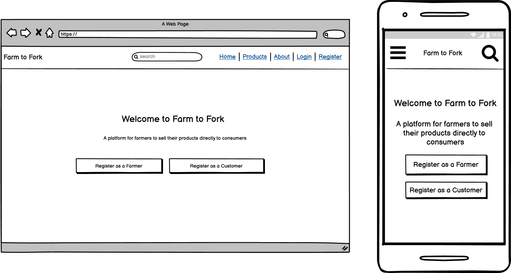
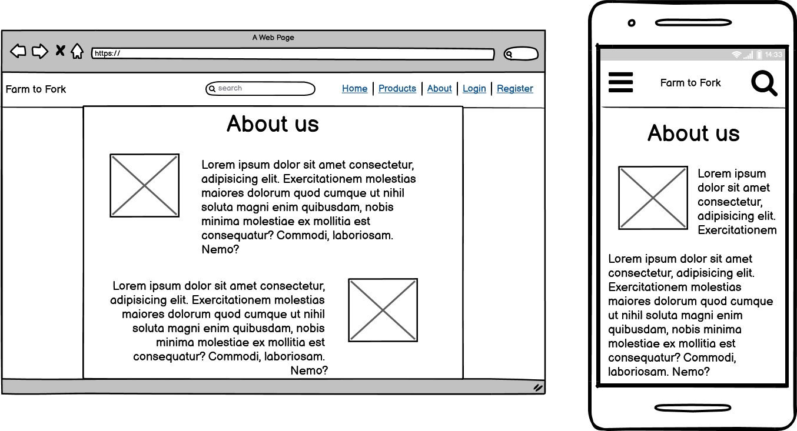
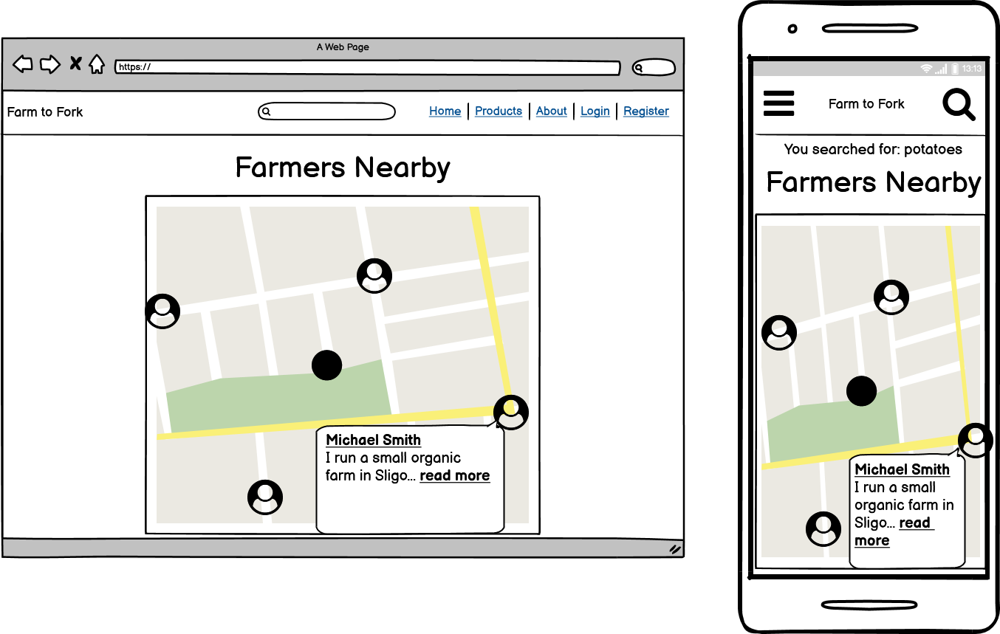
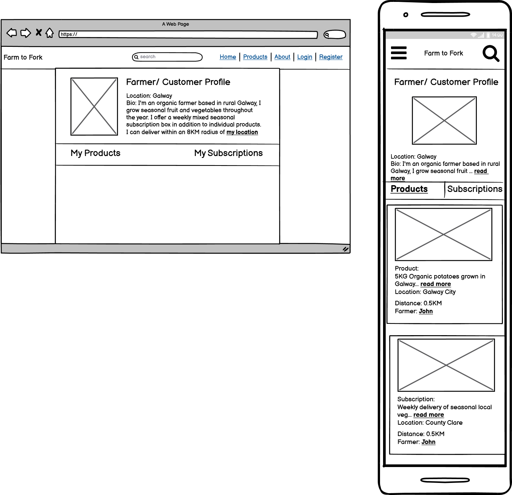
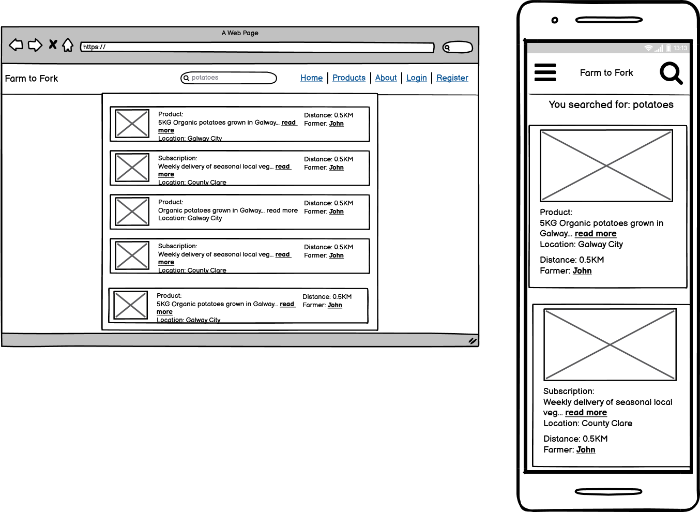

# Farm-To-Fork

Vegetable Delivery Service

### Site Owner Goals:

- To encourage new farmers to advertise their products on the site.
- To encourage new customers to buy products and/or subscriptions.
- To address any issues/concerns faced by either the farmers or customers.

### User Stories

##### All Users

- As a first time visitor to the site I would like to understand its' purpose.
- I would like to browse any current products offered by farmers.
- I would like to see the locations of farmers currently using the service.
- I would like to see the prices of products offered by farmers.
- I would like to see the delivery rates charged by farmers.
- I would like to compare the products of nearby farmers.
- I would like to compare the prices of nearby farmers.
- I would like to understand the different categories of products/subscriptions.
- I would like to register for the service as a farmer/customer.
- I would like to login/logout of the website.

##### Farmers:

- I would like to see what percentage of the price paid by customers is given to farmers.
- I would like to see how often farmers are paid.
- I would like to know which payment method is used to pay farmers.
- I would like to add my details for customers to view (location, delivery range, delivery schedule, personal bio).
- I would like to offer a product or subscription.

##### Customers:

- I would like to search for products and subscriptions.
- I would like to view info about a farmer (location, delivery range, personal bio, delivery schedule)
- I would like to filter by type(product/subscription), distance, keyword, and rating.
- I would like to pay for a product or subscription if I am located within the delivery range, or if I can collect it.
- I would like to select a delivery day from the farmers delivery schedule.

### Development plan from user stories:

| As A:           | I want to be able to...    | So that I can...                         |
| --------------- | -------------------------- | ---------------------------------------- |
| Site User       | View a landing page        | Discover the purpose of the site         |
| Farmer/Customer | Register an account        | Add/buy products/subscriptions           |
| Farmer/Customer | Login/Logout of my account | View my account details/orders etc.      |
| Farmer/Customer | Add my location            | Show only Products/subscriptions near me |

### Database Schema:

**Database Schema** 

###### Frontend Structure:

Navigation Links: Home, About, Support, Login/Register, Search products/subscriptions
Footer: social links, support, farmer fees, FAQs

###### Page Structure:

- Home: Banner Image, CTA buttons: Customer, Farmer
- Login: Login form
- Register: Registration form
- Browse/Search: List products, subscriptions, farmers
- Map view: show points on map with farmers

Map feature:

- When a farmer signs up they must add their location before adding products
- Use Google Places API to find coordinates based on users address
- Frontend validation to geocode address before submitting
- Use GeoDjango to store location info and to enable sorting farmers by distance
- Customers can search within a radius and view the results on a map or on a list
- To reduce API calls, customers need to take an additional step to check if a farmer will deliver to them (based on customer location, farmer location and the farmers own delivery radius)

### Planning user types and permissions:

###### All user permissions:

- can login
- can logout
- can edit profile info
- can upload profile photo
- can delete profile

###### Farmer specific permissions:

- can add product/subscription
- can edit product/subscription
- can delete product/subscription

###### Customer specific permissions:

- can add products/subscriptions to shopping cart
- can purchase products/subscriptions

### Wireframes

**Home Page** 
**About Page** 
**Map Page** 
**Profile Page** 
**Profile Page** 
**Add Product Page** 
